# TaskFlow — командная доска задач

TaskFlow — это fullstack-приложение для управления задачами с авторизацией, ролями (админ/пользователь), дедлайнами и фильтрацией. Построено на Next.js 15, Prisma, SQLite, Tailwind.

---

## День 1 — Инициализация

**Что сделано:**
Создан Next.js проект (TS, Tailwind, App Router), настроены ESLint, Prettier, Husky, переменные окружения, базовый layout.

**С чем столкнулись:**

- `create-next-app` не инициализировал git → сделали вручную `git init`.
- Ошибка с npm-зеркалом (`gitverse.ru`) — битый JSON → сменили registry на официальный.
- Tailwind v4 требует `@import "tailwindcss"` вместо старых директив.

**Ключевой код:**

```typescript
// next.config.js
const nextConfig = {
  reactStrictMode: true,
  compiler: { removeConsole: process.env.NODE_ENV === 'production' },
  env: { NEXT_PUBLIC_APP_NAME: 'TaskFlow' },
}
```

## День 2 — Маршруты и UI

**Что сделано:**
Созданы групповые папки `(auth)` и `(dashboard)`, страницы логина/регистрации, переиспользуемые компоненты `Button` и `Input`.

**С чем столкнулись:**

- `layout.tsx` внутри `register/` вызывал ошибку → оставили только `page.tsx`.
- `app/page.tsx` перекрывал `(dashboard)/page.tsx` → удалили корневой `page.tsx`.
- В `(auth)/layout.tsx` нельзя использовать `<html>` и `<body>` — они уже есть в корневом layout.

**Ключевой код:**

```tsx
// components/ui/Button.tsx
export function Button({ variant = 'primary', children, ...props }) {
  const variants = {
    primary: 'bg-blue-600 text-white hover:bg-blue-700',
    secondary: 'bg-gray-200 text-gray-800 hover:bg-gray-300',
  }
  return (
    <button className={`px-4 py-2 rounded-lg ${variants[variant]}`} {...props}>
      {children}
    </button>
  )
}
```

## День 3 — API и JSON

**Что сделано:**
Создана файловая БД (`db.json`), утилиты для чтения/записи, реализованы API-роуты для регистрации и логина с хешированием паролей (bcrypt).

**С чем столкнулись:**

- `JSON.stringify({ payload })` отправлял объект с ключом `payload` → исправили на `JSON.stringify(payload)`.
- Ошибка типов `Omit<User, ...>` и порядок полей при spread → явно перечисляем поля, чтобы избежать конфликтов.
- `findUserByMail` возвращал `undefined` → добавили проверку `if (!user) return 401`.
- При создании пользователя `role` и `createdAt` генерируются сервером, а не приходят от клиента → используем `Omit` в типе.
- Пароль нужно хранить в зашифрованном виде → добавили `bcrypt` для хеширования.

**Ключевой код:**

```typescript
// lib/db.ts — утилиты для работы с JSON
export function readDB(): DB {
  const data = fs.readFileSync(dbPath, 'utf-8')
  return JSON.parse(data)
}

export function writeDB(data: DB): void {
  fs.writeFileSync(dbPath, JSON.stringify(data, null, 2))
}

export function createUser(userData: Omit<User, 'id' | 'role' | 'createdAt'>): User {
  const db = readDB()
  const newUser: User = {
    id: Date.now(),
    ...userData,
    role: 'user',
    createdAt: new Date().toISOString(),
  }
  db.users.push(newUser)
  writeDB(db)
  return newUser
}

export function findUserByEmail(email: string): User | undefined {
  return getUsers().find((user) => user.email === email)
}
```

## День 4 — Авторизация и защита

**Что сделано:**
Внедрена JWT-авторизация с `httpOnly` cookies, создан middleware для защиты дашборда, реализован logout, добавлен UserContext для хранения данных пользователя на клиенте.

**С чем столкнулись:**

- `jsonwebtoken` не работает в Edge Runtime (среде выполнения middleware) → заменили на `jose`.
- `JWT_SECRET` не загружался → перенесли `.env.local` в корень проекта и перезапустили сервер.
- Middleware не срабатывал → переместили `middleware.ts` в корень (рядом с `app/`).
- После удаления cookie доступ к дашборду сохранялся → проблема была в логике `!token` → исправили на проверку `isValidToken`.
- Контекст пользователя сбрасывался после F5 → синхронизировали с `localStorage`.

**Ключевой код:**

```typescript
// lib/auth.ts — работа с JWT и получение userId
import { jwtVerify } from 'jose'

function getJwtSecret() {
  const secret = process.env.JWT_SECRET
  if (!secret) throw new Error('JWT_SECRET is not defined')
  return new TextEncoder().encode(secret)
}

export async function getUserId(request: NextRequest): Promise<number | null> {
  const token = request.cookies.get('token')?.value
  if (!token) return null

  try {
    const { payload } = await jwtVerify(token, getJwtSecret())
    return payload.userId as number
  } catch {
    return null
  }
}
```

## День 5 — Задачи

**Что сделано:**
Созданы API для CRUD задач (`GET` и `POST`), форма создания на дашборде с оптимистичными обновлениями, список задач с фильтрацией по пользователю, исправлена потеря контекста (localStorage), решены проблемы с загрузчиком и типизацией.

**С чем столкнулись:**

- `fs` в клиентском компоненте → убрали импорт `createTask`, оставили только `fetch`.
- `GET /api/tasks` не возвращал данные → добавили `GET`-обработчик с чтением `db.json`.
- Пустой ответ от сервера (`Unexpected end of JSON input`) → добавили `try/catch` и корректные `NextResponse.json()`.
- Список задач не обновлялся после создания → реализовали оптимистичное обновление (задача добавляется в UI сразу).
- `userId` мог быть `undefined` → добавили проверку `if (!user)` в `handleSubmit`.
- Контекст пользователя сбрасывался после F5 → синхронизировали `UserContext` с `localStorage`.
- Все задачи видели все пользователи → в `GET /api/tasks` добавили фильтрацию по `userId` через `getUserId(request)`.
- Синтаксис `NextResponse` без `.json()` → исправили на `NextResponse.json()`.
- `GET` не принимал `request` → добавили параметр `request: NextRequest`, чтобы читать cookies.

**Ключевой код:**

```typescript
// app/api/tasks/route.ts
import { getUserId } from '@/lib/auth'
import { getTasks, createTask } from '@/lib/db'
import { NextRequest, NextResponse } from 'next/server'

export async function GET(request: NextRequest) {
  try {
    const userId = await getUserId(request)
    if (!userId) {
      return NextResponse.json({ error: 'Unauthorized' }, { status: 401 })
    }

    const allTasks = getTasks()
    const userTasks = allTasks.filter((task) => task.userId === userId)
    return NextResponse.json(userTasks, { status: 200 })
  } catch (error) {
    return NextResponse.json({ error: 'Ошибка получения задач' }, { status: 500 })
  }
}

export async function POST(request: NextRequest) {
  try {
    const userId = await getUserId(request)
    if (!userId) {
      return NextResponse.json({ error: 'Unauthorized' }, { status: 401 })
    }

    const body = await request.json()
    const { title, description, status, deadline } = body

    if (!title) {
      return NextResponse.json({ error: 'Поле title обязательно' }, { status: 400 })
    }

    const newTask = createTask({
      title,
      description,
      status: status || 'pending',
      deadline,
      userId,
    })

    return NextResponse.json({ task: newTask, message: 'Задача создана' }, { status: 201 })
  } catch (error) {
    return NextResponse.json({ error: 'Ошибка создания задачи' }, { status: 500 })
  }
}
```

## День 6 — Редактирование, удаление, статус, поиск

Что сделано:
Созданы API для обновления и удаления отдельных задач (PUT и DELETE), реализовано инлайн-редактирование на дашборде, добавлено переключение статуса, реализован клиентский поиск по задачам.

С чем столкнулись:

params как Promise в Next.js 15 — прямой доступ к params.id вызывает ошибку, нужно разворачивать через await

Типизация params — правильное объявление: { params }: { params: { id: string } }, а не params: { id: string }

Безопасность при обновлении/удалении — забывали проверять task.userId === userId, из-за чего пользователь мог редактировать чужие задачи

findIndex и проверка на -1 — нельзя использовать if (!taskIndex), так как -1 — это truthy значение; только строгая проверка taskIndex === -1

splice возвращает массив удалённых элементов — присваивали результат splice переменной и сохраняли в базу, из-за чего терялись все остальные задачи

Обновление UI только при успешном ответе — обновляли список задач даже при ошибке сервера, что приводило к рассинхрону

Поиск через API или на клиенте? — изначально думали отправлять запрос на сервер при каждом вводе, но выбрали клиентскую фильтрацию (быстрее и проще)

Пустое состояние при поиске — если поиск ничего не находил, показывалось "Задач пока нет" вместо "Ничего не найдено"

```typescript
    // app/api/tasks/[id]/route.ts
    import { getUserId } from '@/lib/auth'
    import { getTasks, readDB, writeDB } from '@/lib/db'
    import { NextRequest, NextResponse } from 'next/server'

    // PUT — обновление задачи
    export async function PUT(
      request: NextRequest,
      { params }: { params: Promise<{ id: string }> }
    ) {
      const userId = await getUserId(request)
      if (!userId) {
        return NextResponse.json({ error: 'Unauthorized' }, { status: 401 })
      }

      try {
        const { id } = await params
        const body = await request.json()
        const { title, description, status, deadline } = body

        const tasks = getTasks()
        const taskIndex = tasks.findIndex(
          task => task.id === Number(id) && task.userId === userId
        )

        if (taskIndex === -1) {
          return NextResponse.json({ error: 'Задача не найдена' }, { status: 404 })
        }

        const updatedTask = {
          ...tasks[taskIndex],
          title: title ?? tasks[taskIndex].title,
          description: description !== undefined ? description : tasks[taskIndex].description,
          status: status ?? tasks[taskIndex].status,
          deadline: deadline !== undefined ? deadline : tasks[taskIndex].deadline,
          updatedAt: new Date().toISOString(),
        }

        const db = readDB()
        db.tasks[taskIndex] = updatedTask
        writeDB(db)

        return NextResponse.json(
          { task: updatedTask, message: 'Задача обновлена' },
          { status: 200 }
        )
      } catch (error) {
        console.error('Ошибка обновления задачи:', error)
        return NextResponse.json(
          { error: 'Внутренняя ошибка сервера' },
          { status: 500 }
        )
      }
    }

    // DELETE — удаление задачи
    export async function DELETE(
      request: NextRequest,
      { params }: { params: Promise<{ id: string }> }
    ) {
      const userId = await getUserId(request)
      if (!userId) {
        return NextResponse.json({ error: 'Unauthorized' }, { status: 401 })
      }

      try {
        const { id } = await params
        const tasks = getTasks()
        const taskIndex = tasks.findIndex(
          task => task.id === Number(id) && task.userId === userId
        )

        if (taskIndex === -1) {
          return NextResponse.json({ error: 'Задача не найдена' }, { status: 404 })
        }

        tasks.splice(taskIndex, 1)
        const db = readDB()
        db.tasks = tasks
        writeDB(db)

        return NextResponse.json(
          { message: 'Задача удалена' },
          { status: 200 }
        )
      } catch (error) {
        console.error('Ошибка удаления задачи:', error)
        return NextResponse.json(
          { error: 'Внутренняя ошибка сервера' },
          { status: 500 }
        )
      }
    }


    // app/(dashboard)/page.tsx — клиентская фильтрация поиска
    const [searchTerm, setSearchTerm] = useState('')

    const filteredTasks = tasks.filter(
      (task) =>
        task.title.toLowerCase().includes(searchTerm.toLowerCase()) ||
        task.description?.toLowerCase().includes(searchTerm.toLowerCase())
    )

    // Инлайн-редактирование
    {editingTask?.id === task.id ? (
      // форма редактирования
    ) : (
      // обычный просмотр
    )}
```

✅ Полный CRUD для задач (создание, чтение, обновление, удаление)

✅ Безопасность на уровне API (проверка принадлежности задачи пользователю)

✅ Инлайн-редактирование без перезагрузки страницы

✅ Клиентский поиск по названию и описанию

✅ Адаптация под Next.js 15 (асинхронный params)

## День 8 — Миграция на Prisma client

**Что сделано:**

**Шаг 1. Установка Prisma**

npm install prisma @prisma/client

**_Что сделали: Установили два пакета:_**

prisma — CLI-инструмент для работы с БД (миграции, генерация клиента)

@prisma/client — ORM, который будет выполнять запросы в коде

Зачем: Чтобы работать с БД через код, а не писать SQL вручную.

БД — это отдельная сущность, и ORM — это мост между твоим бэкендом и этой сущностью.
[Фронтенд] → [Бэкенд] → [ORM] → [База данных]

**Шаг 2 — npx prisma init**

Что сделали:

Выполнили команду npx prisma init в терминале.

Что произошло под капотом:

Создалась папка prisma/ в корне проекта.

Внутри неё появился файл schema.prisma — главный файл, где мы описываем структуру будущих таблиц (модели) и настройки подключения к БД.

В корне проекта появился файл .env (или обновился, если уже был). В него Prisma автоматически записал переменную DATABASE_URL со значением-заглушкой для подключения к БД (обычно к PostgreSQL).

Зачем это нужно:

schema.prisma — это чертёж твоей базы данных. Здесь ты в одном месте описываешь все таблицы, поля и связи между ними. Это как db.json, но в виде кода и с поддержкой типов.

.env — для безопасного хранения секретов. Строка подключения к БД содержит пароль, поэтому её нельзя хранить в коде.

**Шаг 3 — Настройка schema.prisma**

Что делали:
Открыли файл prisma/schema.prisma и описали структуру базы данных: какие будут таблицы, какие поля, как они связаны.

**Шаг 4 — Настройка подключения к БД (datasource)**

Что делали:
Настроили в prisma/schema.prisma блок datasource db, указав, что будем использовать SQLite и где лежит файл базы данных.

**_Зачем это нужно:_**
provider = "sqlite" — говорим Prisma, какую БД используем

url — говорим, где находится файл БД (в папке prisma/ будет создан dev.db)

process.env["DATABASE_URL"] — берём значение из .env, чтобы не хранить пути в коде

Что это даёт:
✅ Prisma знает, с какой БД работать
✅ Настроено подключение без паролей (SQLite — это просто файл)
✅ Можно легко поменять БД, поменяв provider и url в одном месте

**Шаг 5 — Создание и применение миграции**

npx prisma migrate dev --name init

Что делали:
Выполнили команду, которая создала и применила миграцию к БД.

**Что произошло под капотом:**
Фронтенд → отправляет запрос на Бэкенд (например, POST /api/tasks)

Бэкенд → вызывает Prisma ORM (например, prisma.task.create())

Prisma → переводит это в SQL и отправляет в Базу данных

База данных → возвращает результат (строки таблиц)

Prisma → превращает их в JS-объекты

Бэкенд → возвращает JSON на Фронтенд
Схема: 

Что мы получили:
✅ База данных dev.db с таблицами users и tasks
✅ Папка migrations/ с историей изменений
✅ Prisma Client готов к использованию
✅ БД синхронизирована со схемой
